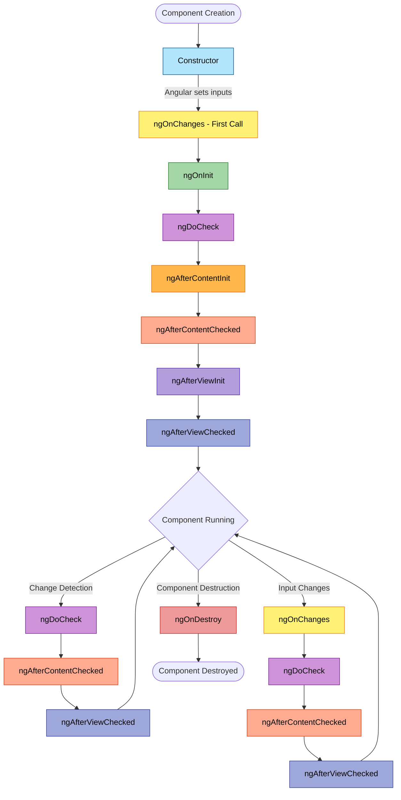

# Angular Component Lifecycle

## Lifecycle Hooks Overview

Angular components go through a lifecycle managed by Angular. Angular creates, renders, creates and renders children, checks when data-bound properties change, and destroys components before removing them from the DOM.

## Complete Lifecycle Diagram



## Lifecycle Hooks Detailed Explanation

### 1. **Constructor**
- **When**: First, when Angular instantiates the component class
- **Purpose**: Basic initialization, dependency injection
- **Use Case**: Initialize class members, inject services
- **Note**: DOM is NOT available, @Input properties are NOT set

```typescript
constructor(private service: MyService) {
  console.log('Constructor called');
}
```

### 2. **ngOnChanges**
- **When**: Before ngOnInit and whenever one or more data-bound input properties change
- **Purpose**: React to input property changes
- **Parameter**: SimpleChanges object containing previous and current values
- **Use Case**: Perform actions based on input changes

```typescript
ngOnChanges(changes: SimpleChanges) {
  if (changes['inputProperty']) {
    console.log('Previous:', changes['inputProperty'].previousValue);
    console.log('Current:', changes['inputProperty'].currentValue);
  }
}
```

### 3. **ngOnInit**
- **When**: Once, after the first ngOnChanges
- **Purpose**: Component initialization after inputs are set
- **Use Case**: Fetch initial data, set up subscriptions
- **Note**: Called only ONCE during component lifecycle

```typescript
ngOnInit() {
  console.log('Component initialized');
  this.loadData();
}
```

### 4. **ngDoCheck**
- **When**: During every change detection cycle
- **Purpose**: Detect and act upon changes Angular can't detect on its own
- **Use Case**: Custom change detection logic
- **Warning**: Called very frequently - keep lightweight!

```typescript
ngDoCheck() {
  if (this.myValue !== this.previousValue) {
    console.log('Custom change detected');
    this.previousValue = this.myValue;
  }
}
```

### 5. **ngAfterContentInit**
- **When**: Once, after Angular projects external content into the component
- **Purpose**: Initialize content children (@ContentChild/@ContentChildren)
- **Use Case**: Access and manipulate projected content

```typescript
ngAfterContentInit() {
  console.log('Content initialized');
  // Content children are now available
}
```

### 6. **ngAfterContentChecked**
- **When**: After ngAfterContentInit and after every ngDoCheck
- **Purpose**: Respond after Angular checks projected content
- **Use Case**: React to changes in content children
- **Warning**: Called frequently - avoid heavy operations

```typescript
ngAfterContentChecked() {
  console.log('Content checked');
}
```

### 7. **ngAfterViewInit**
- **When**: Once, after Angular initializes component's views and child views
- **Purpose**: Initialize view children (@ViewChild/@ViewChildren)
- **Use Case**: Access DOM elements, initialize third-party libraries

```typescript
ngAfterViewInit() {
  console.log('View initialized');
  // View children and DOM are now available
}
```

### 8. **ngAfterViewChecked**
- **When**: After ngAfterViewInit and after every ngAfterContentChecked
- **Purpose**: Respond after Angular checks component's views and child views
- **Use Case**: React to changes in view children
- **Warning**: Called very frequently - keep operations minimal

```typescript
ngAfterViewChecked() {
  console.log('View checked');
}
```

### 9. **ngOnDestroy**
- **When**: Just before Angular destroys the component
- **Purpose**: Cleanup before component destruction
- **Use Case**: Unsubscribe from observables, detach event handlers, clear timers
- **Critical**: Prevent memory leaks by proper cleanup

```typescript
ngOnDestroy() {
  console.log('Component destroyed');
  this.subscription?.unsubscribe();
  clearInterval(this.timer);
}
```

## Execution Order Summary

### Initial Render
1. Constructor
2. ngOnChanges (if inputs exist)
3. ngOnInit
4. ngDoCheck
5. ngAfterContentInit
6. ngAfterContentChecked
7. ngAfterViewInit
8. ngAfterViewChecked

### On Input Changes
1. ngOnChanges
2. ngDoCheck
3. ngAfterContentChecked
4. ngAfterViewChecked

### On Change Detection (without input changes)
1. ngDoCheck
2. ngAfterContentChecked
3. ngAfterViewChecked

### On Destruction
1. ngOnDestroy

## Best Practices

1. **Keep constructor simple** - Only use for dependency injection
2. **Initialize in ngOnInit** - Component logic should start here
3. **Clean up in ngOnDestroy** - Always unsubscribe and clear resources
4. **Avoid heavy operations** in frequently called hooks (ngDoCheck, ngAfterContentChecked, ngAfterViewChecked)
5. **Use ngOnChanges** to react to @Input changes
6. **Access DOM in ngAfterViewInit** - View is fully initialized here
7. **Use OnPush change detection** to reduce lifecycle hook calls

## Example Component with All Lifecycle Hooks

```typescript
import { Component, Input, OnChanges, OnInit, DoCheck,
         AfterContentInit, AfterContentChecked,
         AfterViewInit, AfterViewChecked, OnDestroy,
         SimpleChanges } from '@angular/core';

@Component({
  selector: 'app-lifecycle-demo',
  template: `
    <h2>Lifecycle Demo</h2>
    <p>Input value: {{ inputValue }}</p>
    <ng-content></ng-content>
  `
})
export class LifecycleDemoComponent implements
    OnChanges, OnInit, DoCheck, AfterContentInit,
    AfterContentChecked, AfterViewInit, AfterViewChecked, OnDestroy {

  @Input() inputValue: string = '';

  constructor() {
    console.log('1. Constructor called');
  }

  ngOnChanges(changes: SimpleChanges) {
    console.log('2. ngOnChanges called', changes);
  }

  ngOnInit() {
    console.log('3. ngOnInit called');
  }

  ngDoCheck() {
    console.log('4. ngDoCheck called');
  }

  ngAfterContentInit() {
    console.log('5. ngAfterContentInit called');
  }

  ngAfterContentChecked() {
    console.log('6. ngAfterContentChecked called');
  }

  ngAfterViewInit() {
    console.log('7. ngAfterViewInit called');
  }

  ngAfterViewChecked() {
    console.log('8. ngAfterViewChecked called');
  }

  ngOnDestroy() {
    console.log('9. ngOnDestroy called');
  }
}
```

## Modern Angular with Signals (Angular 16+)

With signals, the lifecycle becomes simpler:

```typescript
import { Component, OnInit, OnDestroy, effect, signal } from '@angular/core';

@Component({
  selector: 'app-modern',
  template: `{{ count() }}`
})
export class ModernComponent implements OnInit, OnDestroy {
  count = signal(0);

  constructor() {
    // Effect runs whenever signal changes
    effect(() => {
      console.log('Count changed:', this.count());
    });
  }

  ngOnInit() {
    // Initial setup
  }

  ngOnDestroy() {
    // Cleanup (effects are auto-cleaned)
  }
}
```

## Performance Tips

1. **Use OnPush Change Detection Strategy**
   ```typescript
   @Component({
     changeDetection: ChangeDetectionStrategy.OnPush
   })
   ```

2. **Implement trackBy for *ngFor**
   ```typescript
   trackByFn(index: number, item: any) {
     return item.id;
   }
   ```

3. **Avoid complex operations in frequently called hooks**

4. **Use async pipe for observables** - Automatic subscription management

5. **Lazy load components** when possible to reduce initial load